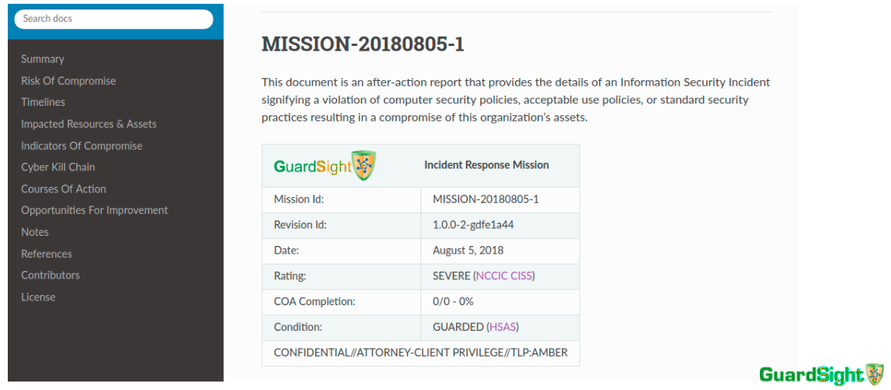
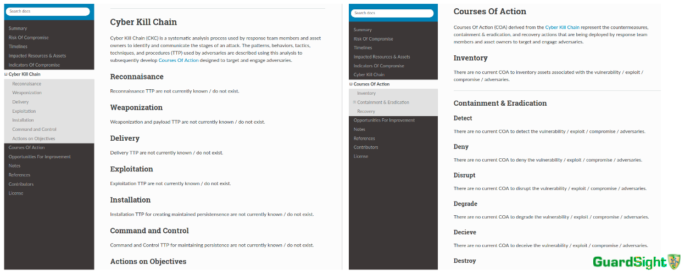
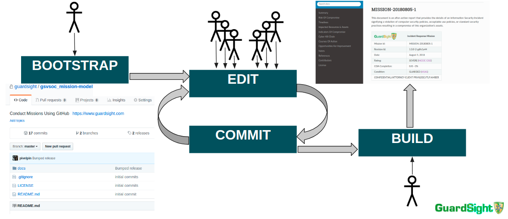

# How-To Develop An Incident Response Report Using GitHub, Sphinx, RTD
### Documenting Incident Response Using GitHub, Sphinx, RTD

#### Prologue

GuardSight analysts use a systematic approach to achieve the objectives of containment, eradication, and recovery during its BreachMasters™ incident response. One component of this approach includes developing content in an iterative manner to describe the adversary compromise as well as the allied response. The aggregated content ultimately results in an after action report. Producing the report during the response has a number of benefits including memorializing in near real-time, accuracy of observations and collections, and exactness of knowledge transfers when transitioning between analysts in order to manage response fatigue. This document discusses a mechanism for developing the incident response content using the revision control hosting system [Github](https://www.github.com), use of the [Sphinx](http://www.sphinx-doc.org/en/master/) documentation generator, and the optional use of the software hosting system [Read the Docs](https://readthedocs.com/).






#### Prerequisites

1. Familiarity with contributing to Github
1. Authorized access to Github
1. Familiarity with publishing documentation using Sphinx
1. Sphinx software for Local builds (optional but recommended)
   ```bash
   pip install sphinx sphinx-autobuild
1.  Authorized access to Read the Docs for business **private** hosting (optional)

	* Non-redacted public postings of after action reports is probably **not smart** - readthedocs.com is **private** - readthedocs.io is **public**
1. Github Settings
   ```bash
   vi ~/.gitconfig
   [user]
	   name = myName
	   email = myName@myEmailDomain

#### Instruction



##### Bootstrap

1. Create a new repo that will  contain the after action report (**notice the private key has its boolean value set to true**)
   ```bash
   cd ~/sandbox/code/github
   MISSION=$(date +'MISSION-%Y%m%d-1')
   MYORG=guardsight # e.g. ==> https://github.com/${MYORG} <== assign MYORG=yourOrganization
   curl -u $(grep name ~/.gitconfig | awk '{print $NF}') -d '{ "name": "'${MISSION}'", "description": "Incident Response After Action Report", "private": true, "has_wiki": false }' https://api.github.com/orgs/${MYORG}/repos
   Enter host password for user 'myName':
1. Duplicate a template repo without forking it and mirror-push its contents into the new repo
   ```bash
   git clone --bare git@github.com:guardsight/gsvsoc_mission-model MISSION-BOOTSTRAP
   cd MISSION-BOOTSTRAP/
   git push --mirror git@github.com:${MYORG}/${MISSION}
   cd .. && rm -rf MISSION-BOOTSTRAP
1. Create a development branch and incorporate the remote repo into the local branch
   ```bash
   git clone git@github.com:${MYORG}/${MISSION} ${MISSION}
   cd ${MISSION}
   git checkout develop
   git pull origin develop
   cd docs
1. Replace some default content
   ```bash
   sed -i "s/MISSION-YYYYMMDD-n/${MISSION}/g" source/index.rst source/meta.txt source/conf.py
1. Replace the GuardSight copyright with ${MYORG} copyright
1. Replace docs/source/meta-logo.png with ${MYORG} logo 
   
IT **IS PERMISSABLE** TO REPLACE THE LOGO AND COPYRIGHT NOTICE IN THE CLONED ${MISSION} AND THE GUARDSIGHT PERMISSION NOTICE **IS NOT REQUIRED** TO BE INCLUDED IN THE CLONED ${MISSION} OR ANY PORTION OF THE AFTER ACTION REPORT
   
##### Edit <=> Commit

1. Develop -> Commit -> Push
   ```bash
   cd ${MISSION}
   git checkout develop; git pull origin develop
   gedit source/*.rst source/meta.txt # sudo apt install gedit-plugin-git; # this shows lines that have changed since last commit;
   # make some changes
   git commit -a -m "Mission update"
   git push --tags origin develop
1. Merge into Master -> Push
   ```bash
   git checkout master
   git merge develop
   git push --tags origin master
   git checkout develop
   
##### Local Build

1. Make up the build
   ```bash
   cd ${MISSION}/docs
   make singlehtml
   make latexpdf

1. View the document
   ```bash
   google-chrome build/html/index.html

##### Read the Docs For Business Build (optional)

1. Import the repo into RTD
	```bash
	google-chrome https://readthedocs.com/dashboard/import/?
	
1. View the document
   ```bash
   google-chrome https://${MYORG}-$(echo ${MISSION} | tr [[:upper:]] [[:lower:]]).readthedocs-hosted.com/en/latest/

